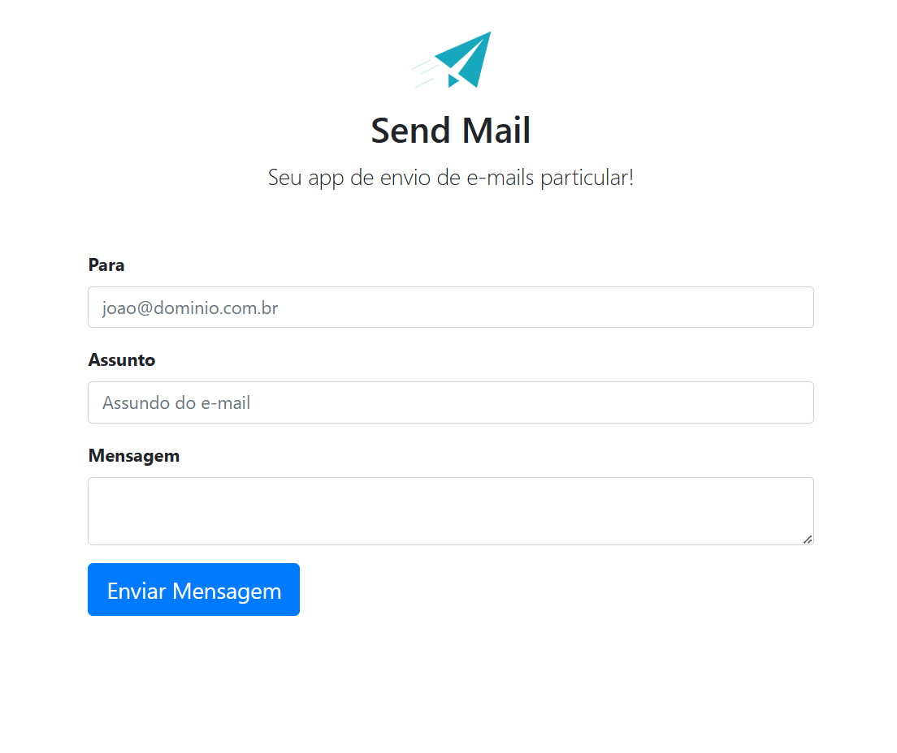

# WEB APPLICATION TO SEND MAIL 
### USING SMTP PROTOCOL

O projeto consiste em utilizar a biblioteca PHPMailer em conjunto com o serviço SMTP do Google para enviar e-mails de forma segura e confiável.

Primeiramente, é necessário criar uma conta de serviço no Google Cloud Console e configurar as credenciais do SMTP. Em seguida, a biblioteca PHPMailer será utilizada para criar um script em PHP capaz de enviar e-mails.

O script irá conter a configuração do SMTP do Google, incluindo o endereço de e-mail e a senha da conta de serviço. Em seguida, o script irá utilizar o PHPMailer para definir o conteúdo do e-mail, incluindo destinatários, assunto e corpo da mensagem.

Após definir o conteúdo do e-mail, o script irá chamar o método send() da classe PHPMailer para enviar o e-mail utilizando o serviço SMTP do Google. É possível também adicionar anexos ao e-mail, definir a prioridade do e-mail e outras configurações avançadas.

Com esse projeto, é possível enviar e-mails de forma segura e confiável utilizando o serviço SMTP do Google e a biblioteca PHPMailer. Isso pode ser útil em diversas aplicações, como sistemas de cadastro, notificações, alertas, entre outros.


### Requisitos Adicionais
Crie o arquivo `APP_SEND_MAIL/secrets.php` do lado do servidor contendo os seguintes parâmetros, a conta deve possuir acesso ao serviço do google:
```.php
<?php
    $username = "<usename>";
    $email = "<email>";
    $password = "<password>";
?>
```



---

The project consists of using the PHPMailer library together with Google's SMTP service to send emails securely and reliably.

First, it is necessary to create a service account on Google Cloud Console and configure the SMTP credentials. Then, the PHPMailer library will be used to create a PHP script capable of sending emails.

The script will contain the configuration of Google's SMTP, including the email address and password of the service account. Then, the script will use PHPMailer to define the content of the email, including recipients, subject, and message body.

After defining the content of the email, the script will call the send() method of the PHPMailer class to send the email using Google's SMTP service. It is also possible to add attachments to the email, set the priority of the email, and other advanced settings.

With this project, it is possible to send emails securely and reliably using Google's SMTP service and the PHPMailer library. This can be useful in various applications, such as registration systems, notifications, alerts, among others.

### Additional Requirements
Create the `APP_SEND_MAIL/secrets.php` file on the server-side containing the following parameters, the account must have access to Google's service:

```.php
<?php
    $username = "<usename>";
    $email = "<email>";
    $password = "<password>";
?>
```
